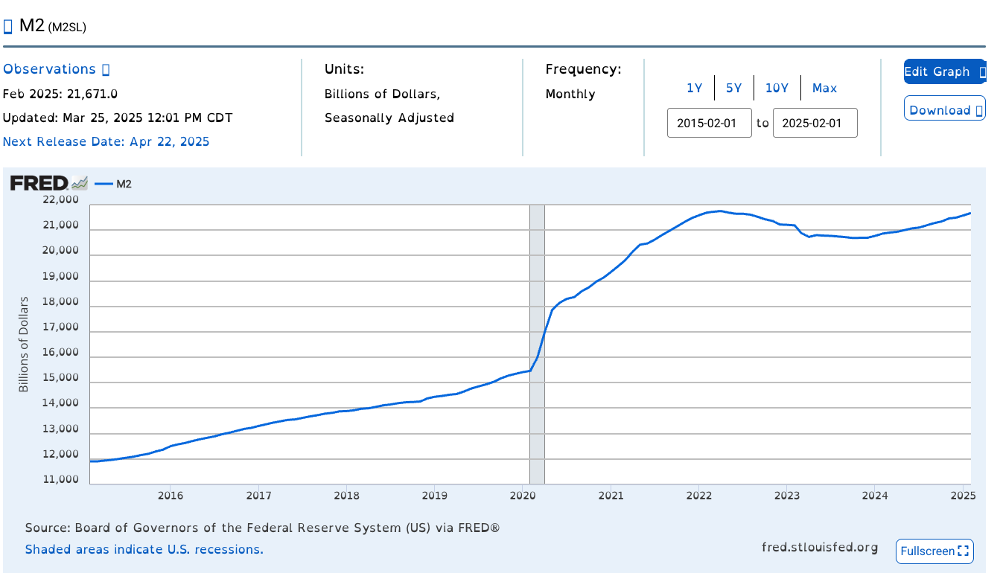
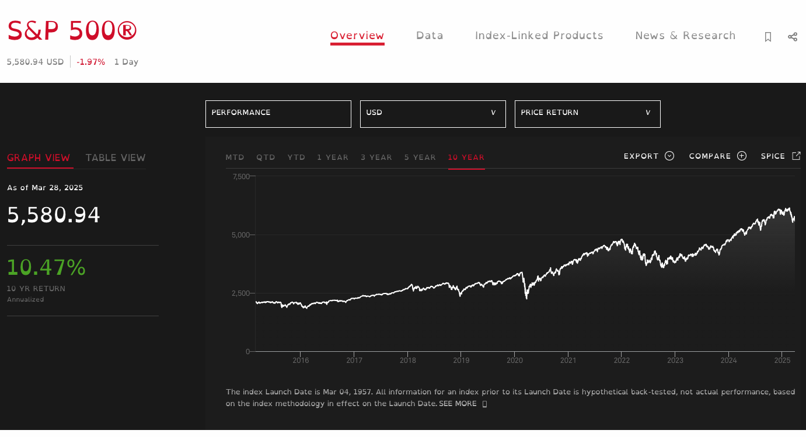
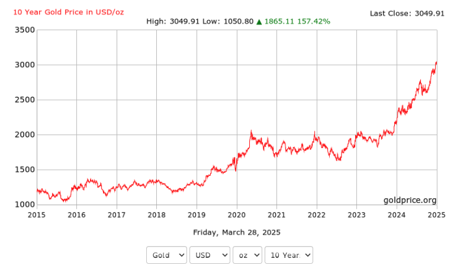
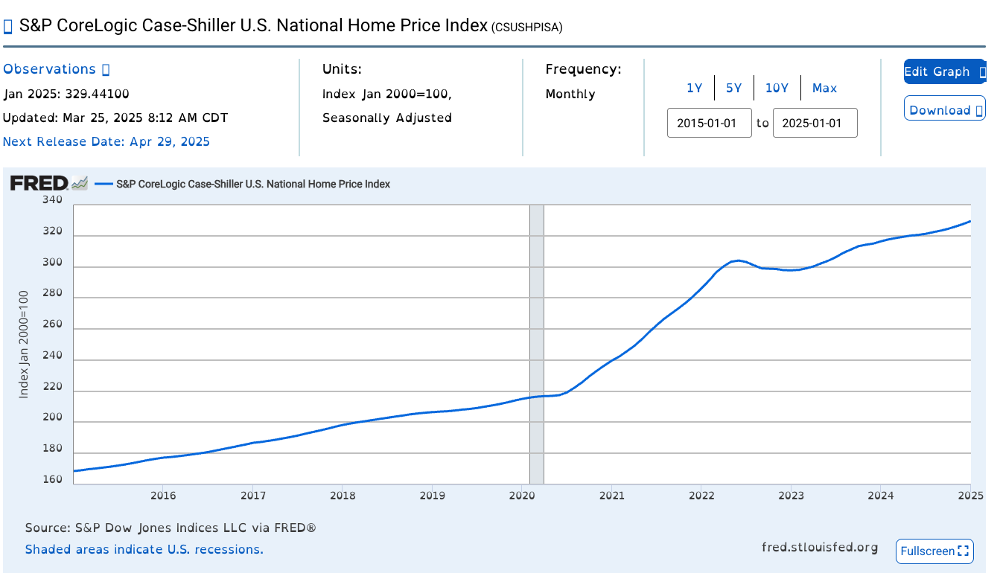
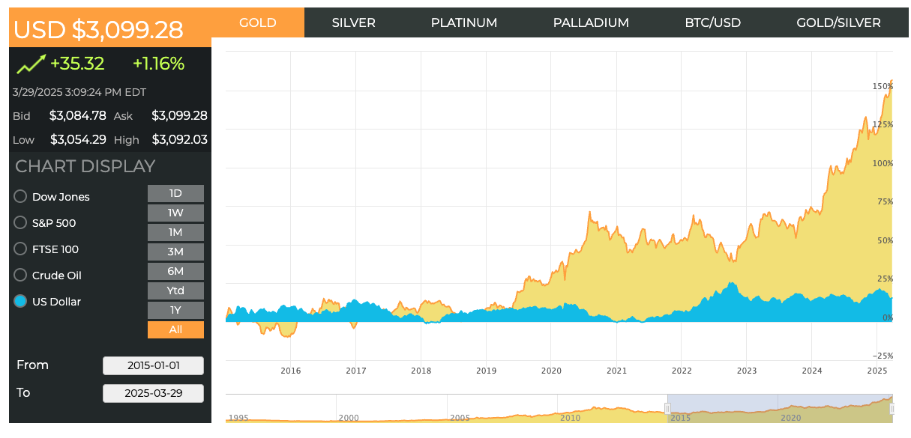
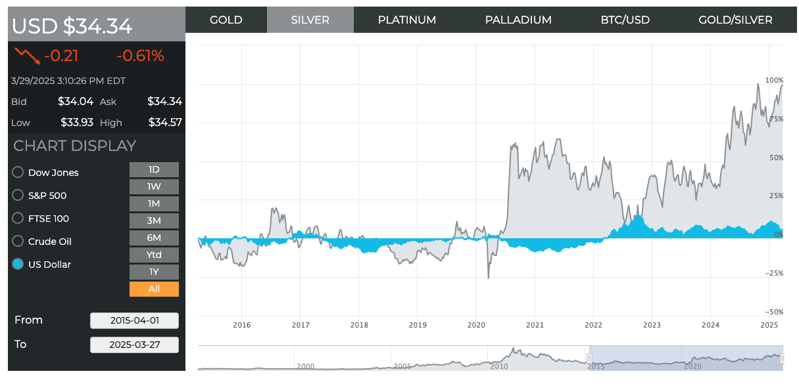
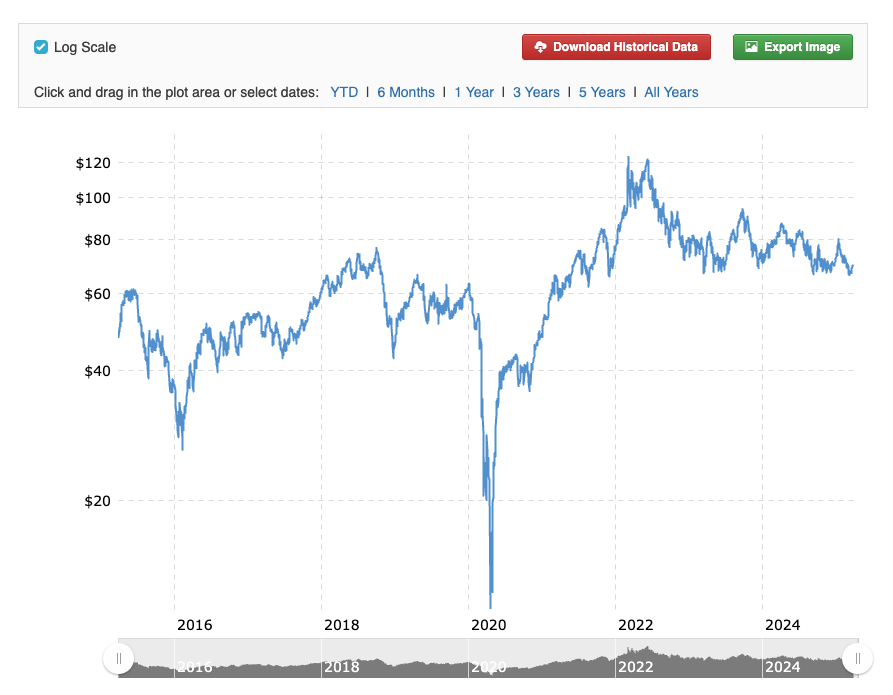
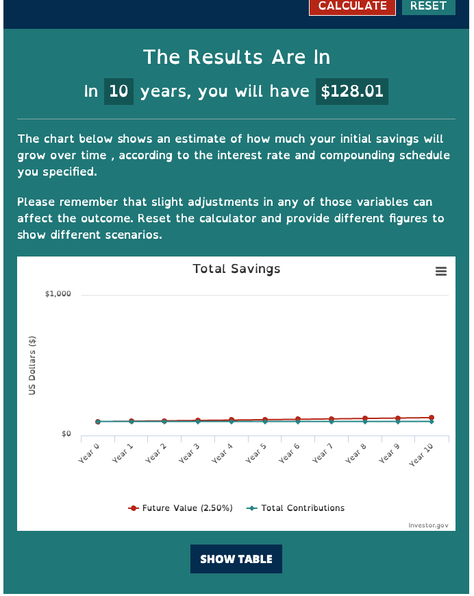

## Does the M2 money supply affect the asset prices
### What is the M2 money supply
M2 includes cash, checking deposits, and easily accessible savings.
### How does the M2 money supply increase
* Central banks set zero or near-zero overnight rates.
* Credit expansion through forgiving credit standards and lower interest rates.
* Central Banks' junk bond purchase program.
* Central Banks fund the government through purchasing debt instruments like treasury notes. 

They call this circus QE! [https://www.investopedia.com/terms/q/quantitative-easing.asp]
### What happens to your hard-earned savings when M2 money supply increases
Look at the following charts and answer that question yourself.

https://fred.stlouisfed.org/series/M2SL

Over the last 10 years, the M2 money supply increased from 12K billion to 22K billion, an 83% cumulative increase. In other words, in just a decade, the central bank created 83% more money out of thin air.

Now, let's look at how this affected the prices of major asset classes.

### S & P 500 Index
https://www.spglobal.com/spdji/en/indices/equity/sp-500/#overview

### Gold Price
https://goldprice.org/gold-price-history.html

### S&P CoreLogic Case-Shiller U.S. National Home Price Index
https://fred.stlouisfed.org/series/CSUSHPISA

### Gold vs Dollar Index
https://www.jmbullion.com/charts/gold-price/

### Silver vs Dollar Index
https://www.jmbullion.com/charts/gold-price/

### Is there any major commodity that did not make any gain against the Dollar index
Yes. Look at the crude oil price for the last 10 years; despite the money supply increasing by 83%, the crude oil is just crude!

https://www.macrotrends.net/2516/wti-crude-oil-prices-10-year-daily-chart

### What if you used a money market instrument to save your money
In the US, the Fed artificially kept the interest rate low for a very long period. As a result, you probably got a 2.5% annual yield.

https://www.investopedia.com/history-of-cd-interest-rates-5223962

Had you deposited 100 dollars in fixed deposit/CD 10 years ago, you're left with 128 dollars today. So, savers are losers, and debtors are winners.

### Conclusion
I know you are familiar with these concepts; you understand what inflation is and how central banks create it. But looking at those charts will leave a lasting impression on you.
When central banks cut interest rates and make money cheap, seize the opportunity to buy high-quality assets. Every time a bubble bursts, central banks will print more money out of thin air—and there’s nothing you can do to stop it. So, use their own weapon against them: DEBT.